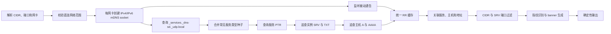

# mDNS 网站测绘 CLI 方案设计

## 1. 最终结论

推荐实现一个 **同一二层网络内、基于 mDNS/DNS-SD 的资产发现器**：程序向标准 mDNS 组播地址发送服务枚举与服务查询，解析 `PTR/SRV/TXT/A/AAAA`，再用输入的 CIDR 和端口范围过滤、聚合并输出资产。

必须明确以下协议事实：

- mDNS 固定使用 `UDP/5353`，服务真实端口来自 DNS-SD 的 `SRV` 记录；端口范围不是 mDNS 探测目标端口列表。
- 标准 mDNS 是链路本地协议，IPv4 使用 `224.0.0.251:5353`，IPv6 使用 `[ff02::fb]:5353`，通常不会经过路由器。
- 因此，单机 CLI 无法可靠扫描任意远端 CIDR。CIDR 只是结果过滤条件，不会被编码进 mDNS 查询；扫描范围实际上由所选二层接口决定。跨 VLAN/路由域需求应在每个二层网络部署采集代理，而不是伪装成完整扫描。
- 示例中的“深度 banner”主要来自 DNS-SD 服务实例、主机地址和 TXT 元数据，不代表对应 TCP 端口已开放。输出必须标记为 `advertised`，不能误报为 `open`。

## 2. 方案选择

### 方案 A：标准组播发现，推荐

在每个目标网卡加入 mDNS 组播组，主动查询并被动收集通告，最后按 CIDR 和端口过滤。

- 优点：符合 RFC 6762/6763；发现完整；能拿到示例要求的 PTR、SRV、TXT、A、AAAA。
- 限制：只能覆盖本机直连的二层网络。
- 选择理由：这是唯一能够对“扫描覆盖率”作出可信承诺的单机方案。

### 方案 B：逐 IP 定向发送 UDP/5353，不推荐作为主路径

部分设备可能响应 legacy unicast 或定向查询，但大量实现不支持；在不知道服务类型和实例名时也无法可靠枚举。

- 仅可作为未来的 `--experimental-unicast` 补充模式。
- 输出必须单独标识低覆盖率，不能用于证明 CIDR 已完整扫描。

### 方案 C：每个二层网络部署采集代理

采集代理执行方案 A，中心端汇总结果。

- 适合跨 VLAN、跨园区资产测绘。
- 不纳入首版 CLI；若验收要求包含远端 CIDR，应直接选择此方案，而不是继续扩展方案 B。

## 3. 首版范围

### 包含

- 输入一个或多个 IPv4/IPv6 CIDR。
- 输入端口表达式，如 `80,443,445,5000-5100`。
- 指定一个或多个网卡；未指定时自动选择与 CIDR 相交的活动网卡。
- 主动发现服务类型、服务实例及其关联记录。
- 被动接收扫描窗口内的 mDNS 通告。
- 解析并关联 `PTR/SRV/TXT/A/AAAA`。
- 通用 TXT 原文保留和按服务类型的深度识别。
- 文本、JSON、JSONL 三种确定性输出。
- 离线数据集回放，保证示例 banner 可以稳定回归。

### 不包含

- 把每个目标 IP 的每个端口当作 mDNS 端口扫描。
- 跨路由器保证发现。
- 首版不主动连接 HTTP、SMB、AFP 等业务端口；后续可用独立 `verify` 阶段验证开放状态。
- 不根据不完整信息猜测主机名、端口或厂商。

## 4. CLI 设计

```bash
# 在线发现
mdnsmap scan \
  --cidr 192.168.1.0/24 \
  --ports 1-65535 \
  --interface en0 \
  --timeout 8s \
  --format text

# 多网段、多端口范围和机器可读输出
mdnsmap scan \
  --cidr 192.168.1.0/24 \
  --cidr fd00:1::/64 \
  --ports 445,548,5000-5100 \
  --format jsonl

# 回放固定数据集，复用在线扫描的解析和聚合链路
mdnsmap replay \
  --input testdata/qnap-nas/packets.jsonl \
  --cidr 192.0.2.0/24 \
  --ports 1-65535 \
  --format text
```

关键参数：

| 参数 | 默认值 | 说明 |
|---|---:|---|
| `--cidr` | 必填 | 可重复；只输出目标网段内地址 |
| `--ports` | `1-65535` | 过滤 `SRV.Port`，不是 mDNS 目标端口 |
| `--interface` | 自动 | 可重复；IPv6 link-local 必须保留 zone/interface |
| `--timeout` | `8s` | 查询、重试和收包总窗口 |
| `--service` | `auto,common` | 自动枚举并补充常见服务种子，可重复 |
| `--format` | `text` | `text`、`json`、`jsonl` |
| `--strict-hop-limit` | `true` | 丢弃 TTL/Hop Limit 非 255 的 mDNS 报文 |
| `--quiet` | `false` | 仅向标准输出写资产数据 |

退出码：

- `0`：扫描完整执行，包括“未发现资产”。
- `2`：参数非法，或 CIDR 无法自动映射接口且用户未显式指定 `--interface`。
- `3`：组播 socket、网卡或权限导致扫描无法执行。
- `1`：其他未预期错误。

诊断信息写入标准错误，资产数据写入标准输出，避免污染 JSON/JSONL。

## 5. 发现流程



### 5.1 查询策略

扫描期间并行执行以下动作，但所有发送都受每网卡速率限制：

1. 查询 `_services._dns-sd._udp.local. PTR`，发现设备支持的服务类型。
2. 补充常见服务类型种子，至少包括：
   - `_workstation._tcp.local.`
   - `_http._tcp.local.`
   - `_smb._tcp.local.`
   - `_qdiscover._tcp.local.`
   - `_device-info._tcp.local.`
   - `_afpovertcp._tcp.local.`
3. 对每种服务查询 `PTR`，得到实例名。
4. 对实例名查询 `SRV` 和 `TXT`。
5. 对 `SRV.Target` 查询 `A` 和 `AAAA`。
6. 收集所有 DNS Answer、Authority、Additional section，不能只读 Answer。

组播查询和组播响应的 DNS Message ID 使用 `0`，不能按普通单播 DNS 的事务 ID 等待单一响应。建议在扫描窗口内发送三轮查询，首次增加小幅随机抖动，后续间隔不短于 `1s` 并指数退避；重复查询携带仍有效的 Known-Answer，执行 Known-Answer Suppression，避免局域网组播风暴。

### 5.2 收包规则

- IPv4 监听 `224.0.0.251:5353`；IPv6 监听 `[ff02::fb]:5353`。
- 通过 `golang.org/x/net/ipv4`、`golang.org/x/net/ipv6` 获取入站网卡、目标地址和 TTL/Hop Limit。
- mDNS 响应应使用 TTL/Hop Limit `255`；默认丢弃无法确认来自本地链路的响应。严格模式以收到的 `255` control message 作为确认依据，阻止跨链路伪造报文混入。
- DNS 消息解析失败只丢弃该包并记录中文调试日志，不能使扫描器退出。
- `TTL=0` 的 goodbye 记录立即从有效缓存移除，但保留可选审计证据。
- 正确处理 RR class 上的 cache-flush bit；先保留 RFC 要求的短暂宽限窗口，再清理同名、同类型、同接口的旧唯一记录。
- 同一 RR 以接口、规范化名称、类型、class 和 RDATA 去重；TTL 只刷新过期时间，不能生成重复资产。

## 6. 关联模型

DNS-SD 的正确关联链如下：

```text
服务类型 --PTR--> 服务实例 --SRV--> 主机名 + 端口
                           |--TXT--> 服务元数据
主机名 ---------------------A/AAAA--> IP 地址
```

不得按“端口唯一”聚合。示例中 `_http._tcp` 和 `_qdiscover._tcp` 都可以使用 `5000/tcp`，必须保留为两条不同服务。

### 6.1 内部实体

```text
RecordEvidence
  interface, source_ip, destination_ip, hop_limit
  received_at, section, rr_name, rr_type, rr_ttl, raw_rdata

ServiceInstance
  service_type, protocol, instance_name
  target_host, port, priority, weight
  txt_raw[], txt_fields{}, addresses[]
  effective_ttl, evidence[]

Finding
  ip, port?, transport, host?, service, instance
  state=advertised, metadata_only, confidence
  banner, fingerprint, evidence
```

`effective_ttl` 用参与构成该 Finding 的 PTR、SRV、TXT、地址记录的最小剩余 TTL 计算；JSON 中仍保留每条原始 RR 的 TTL，避免把多个不同 TTL 错压成一个事实。

### 6.2 无 SRV 的元数据服务

`_device-info._tcp` 等记录可能只有 PTR/TXT，没有可用 SRV。此时：

- 输出 `metadata_only=true` 和 `port=null`。
- 优先使用同一响应中的明确 A/AAAA 证据关联地址。
- 只能退化关联到报文源 IP，且将 `confidence` 降为 `packet-source`。
- 绝不猜测端口或主机名。

## 7. 深度 banner 识别

### 7.1 通用层

所有服务都输出：

1. `Name`：DNS-SD 实例名的首个 label，正确处理 DNS 转义。
2. `IPv4`、`IPv6`：由 SRV target 的 A/AAAA 得到；IPv6 link-local 保留网卡 zone。
3. `Hostname`：SRV target，例如 `slw-nas.local`。
4. `TTL`：`effective_ttl`。
5. TXT 原始字符串：按报文原始顺序保留，不丢失大小写、逗号和未知字段。

### 7.2 服务识别器

采用小型注册表，不做复杂规则引擎：

```text
Recognizer(service_type, txt_raw, instance_name) -> Fingerprint
```

首版识别器：

| 服务 | 深度字段 |
|---|---|
| `workstation` | 从实例名保留设备名；若存在合法 MAC 片段则结构化提取 |
| `http` | `path`、TLS 提示等 TXT 字段 |
| `smb` | 服务名和通用 TXT，不臆测 SMB 版本 |
| `qdiscover` | 解析逗号分隔的 `key=value`：`accessType`、`accessPort`、`model`、`displayModel`、`fwVer`、`fwBuildNum`；满足字段组合时识别为 QNAP NAS |
| `device-info` | `model` 等 Apple 设备描述字段 |
| `afpovertcp` | AFP 服务实例和通用 TXT |

TXT 处理分两层：通用解析仅按每个 DNS TXT character-string 的第一个 `=` 切分；`qdiscover` 的逗号切分只存在于对应识别器中，防止破坏其他服务的合法值。

### 7.3 文本输出

输出按 IP、端口是否为空、端口、服务类型、实例名排序；重复端口的不同服务不合并。目标格式：

```text
services:
9/tcp workstation:
Name=slw-nas [24:5e:be:69:a3:13]
IPv4=192.0.2.10
IPv6=fe80::265e:beff:fe69:a313%en0
Hostname=slw-nas.local
TTL=10
5000/tcp http:
Name=slw-nas
IPv4=192.0.2.10
IPv6=fe80::265e:beff:fe69:a313%en0
Hostname=slw-nas.local
TTL=10
path=/
445/tcp smb:
Name=slw-nas
IPv4=192.0.2.10
IPv6=fe80::265e:beff:fe69:a313%en0
Hostname=slw-nas.local
TTL=10
5000/tcp qdiscover:
Name=slw-nas
IPv4=192.0.2.10
IPv6=fe80::265e:beff:fe69:a313%en0
Hostname=slw-nas.local
TTL=10
accessType=https,accessPort=86,model=TS-X64,displayModel=TS-464C,fwVer=5.2.9,fwBuildNum=20260214
device-info:
Name=slw-nas(AFP)
IPv4=192.0.2.10
IPv6=fe80::265e:beff:fe69:a313%en0
Hostname=slw-nas.local
TTL=10
model=Xserve
548/tcp afpovertcp:
Name=slw-nas(AFP)
IPv4=192.0.2.10
IPv6=fe80::265e:beff:fe69:a313%en0
Hostname=slw-nas.local
TTL=10
answers:
PTR:
_workstation._tcp.local
_http._tcp.local
_smb._tcp.local
_qdiscover._tcp.local
_device-info._tcp.local
_afpovertcp._tcp.local
```

为防终端注入，所有来自网络的控制字符和 ANSI ESC 必须转义；JSON/JSONL 保留等价字符串值。

### 7.4 JSONL 核心字段

每个服务实例和 IP 组合输出一行：

```json
{"ip":"192.0.2.10","port":5000,"transport":"tcp","host":"slw-nas.local.","service":"qdiscover","instance":"slw-nas._qdiscover._tcp.local.","state":"advertised","metadata_only":false,"ttl":10,"txt_raw":["accessType=https,accessPort=86,model=TS-X64,displayModel=TS-464C,fwVer=5.2.9,fwBuildNum=20260214"],"fingerprint":{"vendor":"QNAP","model":"TS-X64","display_model":"TS-464C","firmware_version":"5.2.9","firmware_build":"20260214"},"banner":"..."}
```

`banner` 是面向人的派生字段，结构化字段和 RR evidence 才是事实来源。

## 8. 代码结构

首版控制包数量，避免提前搭建插件框架：

```text
cmd/mdnsmap/main.go              CLI 入口与子命令分发
internal/target/                 CIDR、端口表达式、网卡范围校验
internal/transport/              IPv4/IPv6 组播收发和控制消息
internal/dnssd/                  查询生成、RR 解码、缓存与关联
internal/fingerprint/            少量服务类型识别器
internal/output/                 text/json/jsonl 渲染和终端转义
internal/replay/                 数据集回放输入
testdata/qnap-nas/               脱敏报文与期望输出
```

依赖建议：

- `github.com/miekg/dns`：只负责 DNS message 编解码，保留所有原始 RR。
- `golang.org/x/net/ipv4`、`golang.org/x/net/ipv6`：组播、网卡、TTL/Hop Limit control message。
- CLI 首版使用标准库 `flag.FlagSet`，只有两个子命令，不引入 Cobra。

不选 `grandcat/zeroconf`：高层浏览 API 适合已知单一服务类型，但本项目需要服务枚举、原始 RR、所有 section、Hop Limit 校验和自定义聚合。

不选 `hashicorp/mdns` 作为主解析器：它更偏查询/服务 API，难以完整暴露本方案所需的网络证据和精细控制。

## 9. 并发与边界

- 每个地址族、每个网卡一个接收循环；完整 mDNS querier 从 UDP `5353` 发出组播查询并监听 `5353`。一个中心事件循环拥有 RR 缓存，减少锁和竞态。
- 查询调度器只产生发送任务，不直接修改缓存。
- 输出仅在扫描窗口结束后生成快照，首版不做持续流式更新。
- 限制最大服务类型数、实例数、TXT 总字节数和缓存 RR 数，防止恶意设备耗尽内存。
- 取消由 `context.Context` 统一传播；socket deadline 用于确保退出。
- 扫描超时后等待有界的 goroutine 收尾，禁止泄漏。

建议默认上限：服务类型 `4096`、实例 `65536`、单条 TXT `1300 bytes`、总 RR `100000`；达到上限时产生中文告警并标记结果 `truncated=true`。

## 10. 测试与验证

### 10.1 固定数据集

`testdata/qnap-nas/packets.jsonl` 每行保存：

```text
timestamp, interface, source, destination, hop_limit, payload_base64
```

数据集应覆盖乱序、分包和 Additional section，不能只保存预先聚合后的 JSON。真实地址使用 RFC 5737 文档网段脱敏，TXT 与设备型号字段保留。

配套文件：

- `expected.txt`：与第 7.3 节至少同等深度的 banner。
- `expected.jsonl`：机器可读字段和 fingerprint。

### 10.2 单元与黄金测试

- DNS 压缩名称、转义名称和 malformed packet 不 panic。
- PTR、SRV、TXT、A、AAAA 跨包且乱序到达后仍能正确关联。
- Answer、Authority、Additional section 都能入库。
- `TTL=0` 正确删除；不同 RR TTL 正确计算 `effective_ttl`。
- cache-flush 宽限窗口正确替换旧唯一记录，不误删其他接口上的同名记录。
- 组播 Message ID 为 `0`，重复查询携带 Known-Answer 并按指数退避调度。
- TXT 在第一个 `=` 切分，未知 TXT 原样保留，重复 key 不丢失。
- qdiscover 逗号字段识别出型号和固件。
- 同一端口上的 `http` 与 `qdiscover` 都保留。
- 无 SRV 的 device-info 输出 `port=null`、`metadata_only=true`。
- 端口边界、CIDR 边界、IPv6 zone 和多网卡过滤正确。
- 非 255 Hop Limit、超限数据和控制字符被正确拒绝或转义。
- text 与 JSONL 使用 golden file 做确定性比较。

### 10.3 集成测试

- 用本地 UDP 测试 responder 验证查询到聚合全链路。
- Linux CI 可选使用 network namespace + Avahi 验证真实组播。
- macOS 实机使用 QNAP/兼容设备执行在线验收。
- 运行 `go test ./...`、`go test -race ./...`、`go vet ./...`。

### 10.4 验收标准

1. 对 QNAP 固定数据集，输出包含示例中的六种服务类型。
2. 输出保留 `9/workstation`、`5000/http`、`445/smb`、`5000/qdiscover`、`548/afpovertcp`；两个 `5000` 服务不得互相覆盖。
3. 每个有 SRV 的 Finding 至少包含 `ip`、`port`、`host`、`service`、`banner`。
4. qdiscover banner 原样包含 `accessType`、`accessPort`、`model`、`displayModel`、`fwVer`、`fwBuildNum`，结构化 fingerprint 同时能读取这些字段。
5. device-info 包含 `model=Xserve`，并在缺少 SRV 时明确输出元数据状态而非猜测端口。
6. `answers/PTR` 至少列出示例六个服务类型，顺序确定。
7. `--ports 445,548` 只保留这两个 SRV 端口；元数据服务是否保留由独立规则决定，默认保留并标记 `metadata_only`。
8. CIDR 无法映射到本地接口且未传 `--interface` 时明确失败；显式指定接口后允许扫描同二层中的叠加逻辑子网，但不承诺跨 VLAN/路由域发现。
9. 所有 Finding 标记 `state=advertised`；未执行业务协议验证时不得使用 `open`。
10. 固定数据集重复回放输出逐字节一致，race test 无竞态。

## 11. 风险与取舍

| 风险 | 失败表现 | 处理 |
|---|---|---|
| 把 CIDR 扫描理解为逐 IP 探测 | 远端网段大量漏报却显示成功 | 明确 CIDR 只过滤结果；自动选接口失败时要求显式 `--interface` |
| 设备不响应服务类型枚举 | `_services...` 结果不完整 | 枚举 + 常见服务种子 + 被动通告三路合并 |
| 只解析 Answer | 丢失 SRV/TXT/A/AAAA | 三个 DNS section 统一入 RR 缓存 |
| 按 IP 或端口过早去重 | 示例两个 5000 服务被覆盖 | 服务实例作为主键，最终展开到 IP |
| TXT 过度解析 | 含逗号或等号的合法值被破坏 | 原始值永远保留，服务专用解析器单独派生字段 |
| 将 SRV 当成开放端口 | 资产状态误报 | 固定使用 `advertised`，业务探测另建阶段 |
| 恶意 mDNS 数据 | 内存耗尽、终端注入 | Hop Limit 校验、容量限制、控制字符转义 |
| 多网卡/IPv6 link-local 混淆 | 地址相同但实际链路不同 | 证据携带 ifindex，IPv6 输出保留 zone |

## 12. 实施顺序

1. 完成目标参数解析、直连网段校验和数据模型。
2. 实现 IPv4 单网卡组播收发与 RR 解码。
3. 实现服务枚举、关联缓存和 text/JSONL 输出。
4. 建立 QNAP 回放数据集与 golden tests，先达到示例深度。
5. 增加 IPv6、多网卡、Hop Limit 校验和资源上限。
6. 增加 qdiscover/device-info 等识别器。
7. 完成 race、vet、真实设备在线验收。

## 13. 待确认决策

开始编码前只需确认一项：验收目标资产是否都能从执行机器所选网卡所在的二层广播域直接收到 mDNS 组播。

- 如果是：按推荐方案 A 实现首版。
- 如果不是：应把“每网段采集代理 + 中心汇总”纳入需求，单机 CLI 不能保证跨网段 mDNS 发现完整性。
